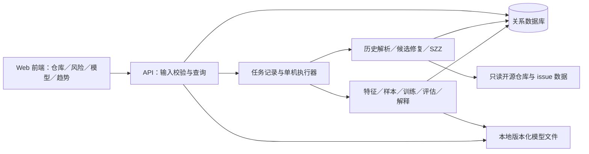
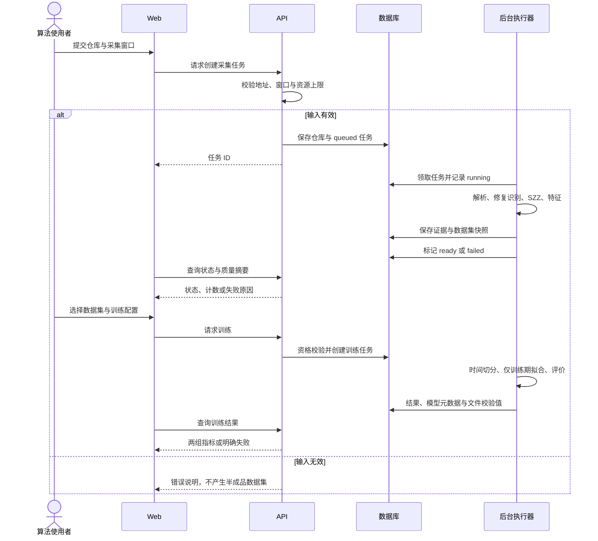
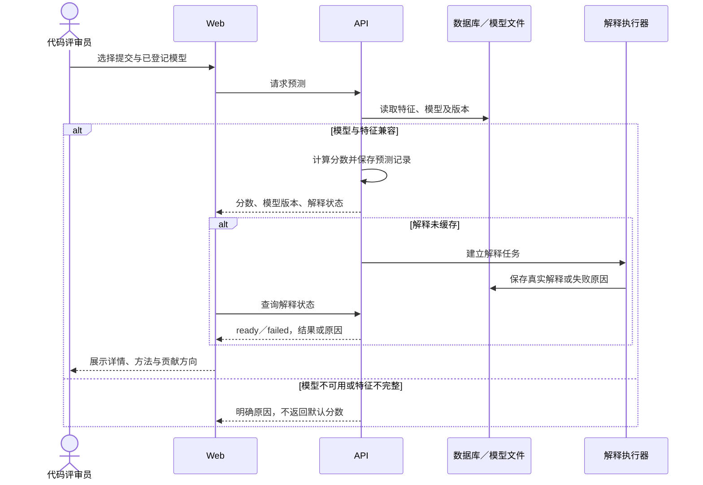
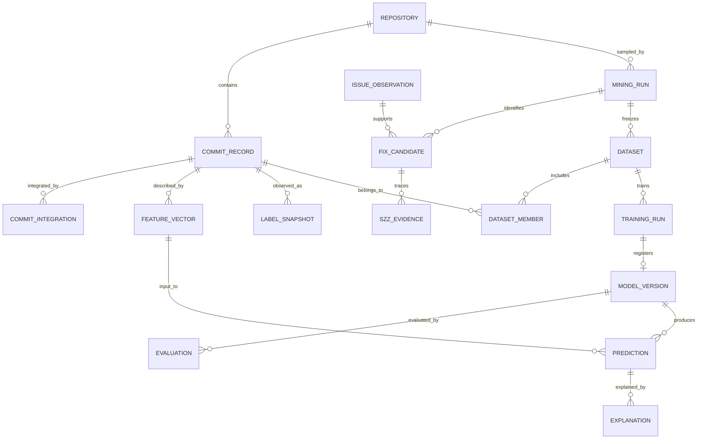

# JIT 缺陷预测系统：产品与技术设计

版本：v0.4 草案。日期：2026-10-05。阶段：Sprint 0。输入：[产品需求文档 v0.6](产品需求文档.md)、课程项目要求第 2–4 页。

**这是待评审设计，不是已经批准的架构或已实现功能说明。** 当前 CSV 单基线代码是技术试做，不能反向锁定需求、技术栈和数据库。团队的真实调研、资源测量和评审结果应修订本稿。

## 1. 用户任务与范围

首要用户候选是代码评审员：进入风险列表，选定仓库与模型，查看某个提交的分数、模型来源和关键特征，再决定是否深入审查。预测表示模型估计的风险，不能当作已确认缺陷，也不能自动决定合并。时间／阈值高级筛选暂缓。

算法使用者准备仓库数据和模型；质量管理者查看历史标签趋势。首个 MVP 只验证一个主仓库的完整链路，最终增量补足两类八种模型、模型比较和历史时间趋势。建议选入24条业务＋2条过程，批量接口、分级、高级筛选和目录图暂缓；逐条范围见[范围拆分](核心范围与任务拆分.md)。多仓库列表不等于跨项目训练。

### 1.1 界面地图

| 编号 | 页面 | 主要内容 | 必要状态 |
|---|---|---|---|
| WF-01 | 仓库接入与列表 | 地址、采集窗口、任务状态、进度、数据质量摘要 | 无仓库、正在处理、就绪、失败可重试 |
| WF-02 | 风险列表 | 仓库／模型选择、概率全局排序、分页、详情；时间／阈值筛选及等级暂缓 | 无模型、无特征、无结果、加载失败 |
| WF-03 | 提交详情 | 提交上下文、分数、模型与训练窗口、14 维特征、局部解释 | 解释待计算／完成／失败；标签 unknown |
| WF-04 | 训练与模型比较 | 数据集版本、训练配置、任务结果、两类指标、登记模型 | 资格不足、任务失败、指标未定义、不可比 |
| WF-05 | 历史趋势 | 时间桶、可观察标签、缺陷数量／占比、unknown；目录分布暂缓 | 无标签、样本未成熟、桶内分母为零 |

图源与示意图在[低保真原型](原型/低保真原型.html)。所有占位值都不是预测结果。无鉴权、多租户和 Webhook 的本地／内网首轮形态需团队复核；若改变部署形态，要重新评估访问控制。

## 2. 候选架构与选型理由

建议三层模块化单体：一个 Web 前端、一个 API 服务、一个单机后台任务执行器和一个关系数据库。先把模块和数据契约分清，暂不拆微服务。理由是四人均为初学者，跨服务部署、网络和一致性会增加首轮成本；长任务仍须与请求分开，API 返回任务 ID，不能长时间阻塞浏览器。

| 层／依赖 | 候选 | 取舍及待核验项 |
|---|---|---|
| 前端 | Vue 3 | 试做已有经验；也可用团队更熟悉的框架，不把现有代码当选型依据的全部 |
| 服务／数据处理 | Python + FastAPI | 减少模型与采集之间的跨语言调用；需要后台任务生命周期设计 |
| 经典模型 | scikit-learn | 统一 fit／predict_proba 包装、配置及版本；具体依赖版本在实施前锁定 |
| 深度模型 | PyTorch | 三种方法、输入及算力仍需评审和小样本 Pilot；当前没有完成验证 |
| 正式数据库 | PostgreSQL 候选；本地试做 SQLite | 待评估并发写入、迁移、备份和团队安装成本；尚未验证 PostgreSQL |
| 历史解析／SZZ | Python 解析库与版本历史工具 | 库及 SZZ 变体待小仓库验证；本轮没有执行仓库采集命令 |
| 模型解释 | 线性贡献／树解释／模型无关方法 | 分模型选择，标注单位、背景样本和算法版本；不把系数贡献叫 SHAP |
| 任务执行 | 单机工作进程 + 数据库任务状态 | 首轮不引入分布式队列；进程中断后不得把 running 自动当成功 |

## 3. 核心流程与时序

业务流程及异常路径见[核心流程设计](核心流程设计_中英.md)。以下时序补足课程要求的入口、业务层、存储与后台任务关系。

### 3.1 数据准备和训练

### 3.2 预测与解释

状态草案：任务 `queued → running → ready/failed/cancelled`；数据集 `building → ready/failed`；模型 `training → ready/failed/invalid`；解释 `pending → ready/failed`。失败重试创建新 attempt 并保留旧失败记录；成功快照不可被重试覆盖。

## 4. 数据库逻辑设计

以下是产品级候选表结构，不是当前 SQLite 试做 schema。所有业务时间用带时区 UTC；展示层可转为本地时间。模型、特征和标签均版本化，预测不依赖后来的标签。

| 表 | 关键字段（草案） | 约束／作用 |
|---|---|---|
| repository | id，canonical_url，name，language，created_at | 规范地址唯一；不是采集状态的唯一来源 |
| mining_run | id，repository_id，window_start/end，target_branch，source_ref，history_cutoff，label_as_of，rule_version，status，counts，source_hash | 每次采集独立；固定所用历史和标签证据范围 |
| commit_record | id，repository_id，sha，parent_shas，author_key，committed_at，message，parse_status | UNIQUE(repository_id, sha)；作者用仓库内匿名键 |
| file_change | id，commit_id，path_before/after，change_type，la，ld，binary_flag | 保存改名前后路径及不可解析原因，支持 Kamei 与 SZZ |
| issue_observation | id，tracker_kind，issue_key，type，status，resolution，retrieved_at，event_time，source_url/hash，pagination_complete | 原始快照／事件不可覆盖；当前状态与重构历史状态分开 |
| commit_integration | id，repository_id，commit_id，target_branch，source_ref，integrated_at，event_source/hash，availability_state | 集成事件与author／committer时间独立；历史不足标unknown |
| fix_candidate | id，mining_run_id，fix_commit_id，issue_ref，issue_observation_id，evidence_type，evidence_time，fix_available_at，decision | 关键词仅为候选证据；issue 类型与核对结论分开 |
| szz_evidence | id，fix_candidate_id，inducing_commit_id，file_path，old_line，algorithm_version，file_filter_version，target_branch，fix_available_at，status，reason | 保存 fix → inducing 的可追溯关系；无法归因不是负例 |
| feature_vector | id，commit_id，feature_schema_version，history_cutoff，ns…sexp，validity，missing_reason | 14 维明确类型、公式版本及历史截止；同版本不可覆盖 |
| label_snapshot | id，mining_run_id，commit_id，label，observed_at，maturity_state，reason，evidence_id | label ∈ {buggy, clean_observed, unknown}；clean_observed 是窗口内未观察到修复 |
| dataset | id，mining_run_id，feature_schema_version，label_policy_version，content_hash，counts，status | 成功后不可变；未知和排除计数保留 |
| dataset_member | dataset_id，commit_id，feature_vector_id，label_snapshot_id | 联合主键；固定快照，不能训练时读取最新标签替换旧标签 |
| training_run | id，dataset_id，model_type，params，seed，split_config，label_cutoff，status，started/ended_at | 保存完整拟合、验证和测试边界、预算和失败原因 |
| model_version | id，training_run_id，artifact_path，artifact_hash，preprocessing_config，dependency_versions，status | 仅成功且校验通过模型可登记；模型文件不由用户上传 |
| evaluation | id，model_version_id，test_manifest_hash，metric_policy_version，threshold，metrics，undefined_reasons | 测试清单和口径不同就不放在同一对比结论中 |
| prediction | id，model_version_id，feature_vector_id，score，risk_policy_version，explanation_status，created_at | score 有限且在 [0,1]；保留模型和特征来源 |
| explanation | id，prediction_id，method，method_version，background_hash，unit，contributions，status，reason | 真实贡献、方向和单位；方法失败不得用固定话术冒充结果 |
| task_attempt | id，task_type，target_id，attempt，state，progress，error_code，log_path | 记录采集、训练及解释任务；重启恢复和重试可追溯 |

建议索引：commit(repository_id, committed_at, sha)、prediction(model_version_id, score, id)、task_attempt(state, task_type)、szz_evidence(inducing_commit_id)。删除仓库前检查模型引用；不能级联删除仍被展示或实验报告引用的快照。物理字段类型、迁移脚本及索引性能留到选型确认和实施阶段。

## 5. 数据与评价协议草案（T-3～T-7）

### 5.1 标签与时间

- 本轮[真实案例核查](../数据核查/ActiveMQ数据可行性核查.md)取得15份公开来源、4个历史issue及8个边界场景。历史AMQ使用Jira，当前官方入口是GitHub Issues；保存tracker和命名空间，不能把数字PR编号直接当Bug issue。正式规模及归因能力仍未验证。
- 优先固定main分支与source_ref；记录单父修复、merge集成和backport来源关系。merge不重复归因已处理的同一修复，其它分支回补不直接混入main清单。
- 关键词和 issue 链接用于识别候选修复，不直接认定缺陷；只看Fixed会把Task误当Bug。解析消息中的issue键，不从diff内的测试注释推断额外修复关联。基础 SZZ 输出的是可疑引入关系；保存路径、行号、修复时间、算法版本、无法归因原因及人工抽样。
- `buggy` 必须有对应规则下的归因证据；`clean_observed` 表示观察窗口内未发现归因证据，不等于永久无缺陷。证据不足、未成熟或已知解析／归因失败影响的样本记 `unknown` 或排除并说明。
- 观察成熟期暂提 **90 天**，仅为待 Pilot 验证的工程参数，不能作为论文标准。统计成熟期变化对正例、负例、unknown 的影响后再定稿。
- 特征使用提交发生时及之前的可得信息；FIX 特征由当时的消息／issue 信息计算，不能使用后来是否被修复的标签。历史特征、词表和归一化不能读取测试期信息。
- 外层暂提按时间前 70%／后 30%，相同时间戳整体放在同一侧；训练时间严格早于测试。调参验证仅从前 70% 再按时间划分，不接触最终测试期。
- **训练标签也必须在训练截止时可用**，不能把测试期间才发生的修复用于训练标签。训练负例只采用在训练截止前已成熟的提交；为测试标签另设延后的观察截止，尾部未成熟样本保持 unknown。因此最终可训练数量会小于简单的“前 70%”，必须报告排除计数。

**标签可得时间与提交时间分开**：当规则要求目标分支已集成＋历史Bug/Fixed证据时，候选`label_available_at=max(integrated_at, qualifying_issue_evidence_at)`。AMQ-9481在4月21日创建修复，4月22日才合入main及变成Fixed；不能用于4月22日零点的训练标签。该公式是工程提议，不是统一学术标准。`retrieved_at`是本次获取时间，不能冒充当年已观测时间；历史事件／分页不完整保持unknown或明确排除。

Kamei特征的文件范围与SZZ归因文件范围分开版本化。该真实修复全路径NF/LA/LD为2/17/8，生产文件单独为1/4/4；不能混用schema。只得到patch时不具备完整祖先历史，不能用默认零值补满AGE、NDEV、EXP等。

2026-10-05增加[标签时间审计试做](../数据核查/标签时间审计模块.md)：CSV另绑定逐行时间契约，固定训练／评价截止，区分迟到标签、unknown、未成熟负例和未来特征信息；离线训练入口只拟合审计准入行。普通非合成CSV/API训练现在拒绝缺失时间契约的情况，合成演示仍标明标签时间未检查。该模块只检查给定历史声明的一致性，没有证明声明、完整SZZ或14维真实特征来源；契约上传／持久化、完整标签修订与成熟期Pilot仍待做。[调研记录](../数据核查/标签延迟与时间切分调研_20261005.md)区分连续与回溯评价结论，90天继续作为待核查参数。

### 5.2 effort 与指标

草案选用审查成本代理 `c = max(1, LA + LD)`；同时报告原始 LA+LD 为零的样本数。这是处理零成本的工程约定，不是耗时实测或通用论文口径。若改为排除零成本样本，应新建口径版本，不可混合比较。

- 用户风险列表按概率降序；effort-aware 评价按 `score / c` 降序。同分以固定提交 ID 排序，保存排序规则版本。
- `Recall@20%Effort`：在总成本 20% 预算内，取从排序开头起的最长完整提交前缀；不拆分提交、不跳过中间大提交去挑便宜样本。分母为测试集全部正例数。报告实际消耗成本和检查数量；第一条超过预算则检查数为 0。
- `Popt`：在 0–100% 成本范围计算累积缺陷召回曲线的梯形面积；oracle 按 `label/c` 排序，worst 使用反向 oracle；以三者面积归一化。明确这是全范围 Popt，不把它写成 Popt@20%。分母退化时返回未定义及原因。
- 分类阈值暂提 0.5，调参或选择阈值仅用训练期验证集。AUC 只有测试标签同时含两类才定义；零预测正例时 Precision 按口径写 0 并报告计数；无真实正例时 Recall、F1、effort Recall 不提供效果结论。
- 至少比较一种经典基线、按变更规模排序基线和固定随机种子的随机排序；相同测试清单、标签、成本和预算。没有优于基线也如实报告，不预设精度达标值。
- 未验证概率校准前，界面叫“模型风险分数（概率输出）”，不要声称“73% 的提交会有缺陷”。解释表示模型贡献，不是缺陷的因果证明。

具体输入、期望值及失败路径见[验收测试设计](验收测试设计.md)，这些是合成手算样例，不是正式模型结果。

可人工核对的边界例：排序后成本为 25、5、70，总成本 100，20% 预算下完整前缀为空；不能跳过首项选择第二项。正例缺失、全部成本相同、分数相同和 oracle/worst 面积相同都需独立验收。

### 5.3 模型集合与资源

课程只明确要求经典／深度两类且总计不少于八种，没有规定必须“5+3”。候选组合为：逻辑回归、朴素贝叶斯、决策树、随机森林、梯度提升树；深度类 MLP、CNN、GRU。团队及教师需确认这些方法与输入的合理性。

MLP 可使用 14 维度量；CNN／GRU 候选使用按真实行序构造的变更或消息 token 序列，并保留 14 维分支。**不能把任意排列的 14 个指标当作自然时间序列。** token化不要求预训练语义模型，但增加数据准备、截断和词表训练成本。需记录diff／消息来源哈希、行序与token规则、只在训练期拟合的词表、OOV及截断上限；不为本轮草案直接增写采集或训练代码。输入与预算未验证前，不承诺深度模型优于经典模型。

正式主仓库训练资格暂提 ≥1000 个有效已标注提交、≥50 个正例，且训练／验证／测试各自两类可评价；该门槛是工程候选，不保证统计效力。Pilot 可用较小数据检查流程，必须与正式效果报告分开。

训练预算候选：每方法不超过 5 组超参数，随机种子 42/43/44；每次训练最多 30 分钟，深度模型上限 30 epoch，验证集早停。记录 CPU／GPU、内存、数据量、耗时及截断；资源实测后调整。超时或失败计入结果，不给未完成模型填指标。

## 6. 非功能验证设计

以下都是待执行方案，不是已取得证据。候选优先选择性能与可靠性作为两项质量验证；解释仍是必交功能验收，易用性可补充。此前草稿把可解释性计入第二项 NFR，课程是否接受应向教师核对。

| 项 | 数据与条件 | 采样／验收草案 | 必留证据 |
|---|---|---|---|
| NFR-1 预测性能 | ready 模型及真实特征，预热后单并发；写明 CPU、RAM、模型、样本数与版本 | 至少 200 次成功请求，端到端服务响应最近秩 P95 < 2 秒；记录失败数和最大值。预测计时不等待解释；缓存解释和异步状态都单列 | 脚本、原始逐次延时、环境、分位数算法、错误统计 |
| NFR-1 解析性能 | 主仓库固定 1 万提交，已在本地的固定快照；不含网络克隆与 issue 下载 | 解析阶段 < 30 分钟；SZZ、特征和全链路耗时分开报告，不能用解析耗时代替全流程 | 窗口、过滤计数、起止日志、硬件、阶段耗时 |
| NFR-2 解释完整性 | 每一种已登记可预测模型，各选至少 30 个提交，包含边界输入 | 每个成功预测最终有至少 3 个真实贡献项、方向、方法和单位；异步完成候选上限 30 秒，失败／超时不计通过 | 预测与解释关联记录、响应、方法参数；零贡献如实标注 |
| NFR-3 可靠性 | 注入采集／训练中断、写入失败、服务重启与模型文件损坏 | 中断不能产生 ready 半成品；重试保留旧 attempt；重启读取成功模型，损坏模型标为 invalid | 故障步骤、前后状态、存储校验值与日志 |
| NFR-4 易用性 | 至少 3 位未参与开发者，用已准备数据与 ready 模型从首页开始 | 不读手册、无人提示，在 5 分钟内完成一次预测并找到模型来源；记录每位是否成功与困难 | 原始计时及匿名观察笔记；静态原型不计该项 |

## 7. 接口契约草案

接口路径、分页大小及状态码在相应产品 change 中定稿；本表是模块边界，不要求现有 PoC 完全遵循。

| 操作 | 输入 | 成功输出 | 异常行为 |
|---|---|---|---|
| 创建采集 | 公开仓库地址、窗口、规则版本 | task_id、queued 状态 | 无效地址／资源不满足时说明原因；不生成 ready 数据集 |
| 查询仓库／任务 | 仓库或 task_id | 状态、计数、失败原因 | 不存在返回明确错误，不泄露内部凭据 |
| 创建训练 | dataset_id、方法、参数、切分及预算 | training_run_id | 资格不满足／不兼容时拒绝并报告计数 |
| 比较模型 | model_version_ids | 同测试清单和口径的两组指标 | 不可比时解释差异，不合成排行榜 |
| 单条预测 | commit_id、model_version_id | prediction_id、score、版本、解释状态 | 无特征／模型失效无分数 |
| 批量预测（暂缓） | 提交 ID 列表和模型版本 | 保持请求顺序的逐项成功／失败结果 | 超限拒绝；部分失败不能丢项 |
| 风险查询 | 仓库、模型、页码；时间／阈值暂缓 | 全局排序的结果、总量、选择条件 | 无结果与服务错误分别呈现 |
| 解释查询 | prediction_id | 状态、方法、贡献与单位 | pending 可轮询，failed 有原因与重试入口 |

## 8. 待决项与设计复核

| 事项 | 评审前需要的输入 | 当前状态 |
|---|---|---|
| 主用户和手动入口是否可用 | 真实访谈与原型反馈 | 调研准备完成，未访谈 |
| 主仓库及SZZ规则 | 固定分支与ref、tracker／issue类型、历史可得性、体积及归因抽查 | 4个历史issue的来源链可复核；全仓库规模／SZZ／训练未验证 |
| 技术栈与数据库 | 团队可维护性、任务恢复方式、安装成本 | 候选设计；试做不是批准 |
| 标签成熟期、切分、成本、阈值 | 数据 Pilot 与人工核算 | §5 参数均为提议 |
| 深度模型与训练预算 | 输入方案、小样本资源测试、教师要求 | 待核验，不能只改模型名称凑数 |
| 两项 NFR 选型和条件 | 教师口径与实际部署／硬件 | 建议性能 + 可靠性，待确认 |

范围意见和待决参数可记录在[离线评审工作页](../团队协作/评审/评审工作页.html)，记录不会自动同步、合并或代表团队批准。

AI 辅助：Codex，2026-10-04。提示词要点：依据课程 Sprint 0 交付要求生成三层架构、数据库逻辑表、采集训练与预测解释时序；区分数据历史截止、标签观察时间、训练窗口与未来标签；所有参数及选型明确为草案，不替团队作出评审结论。人工复核待做。
