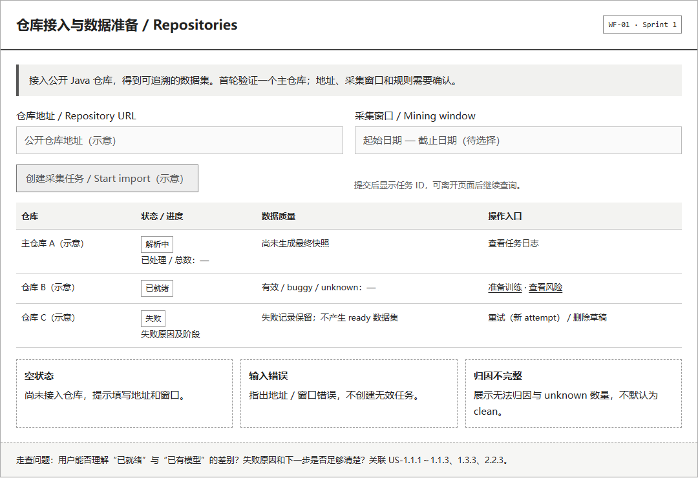
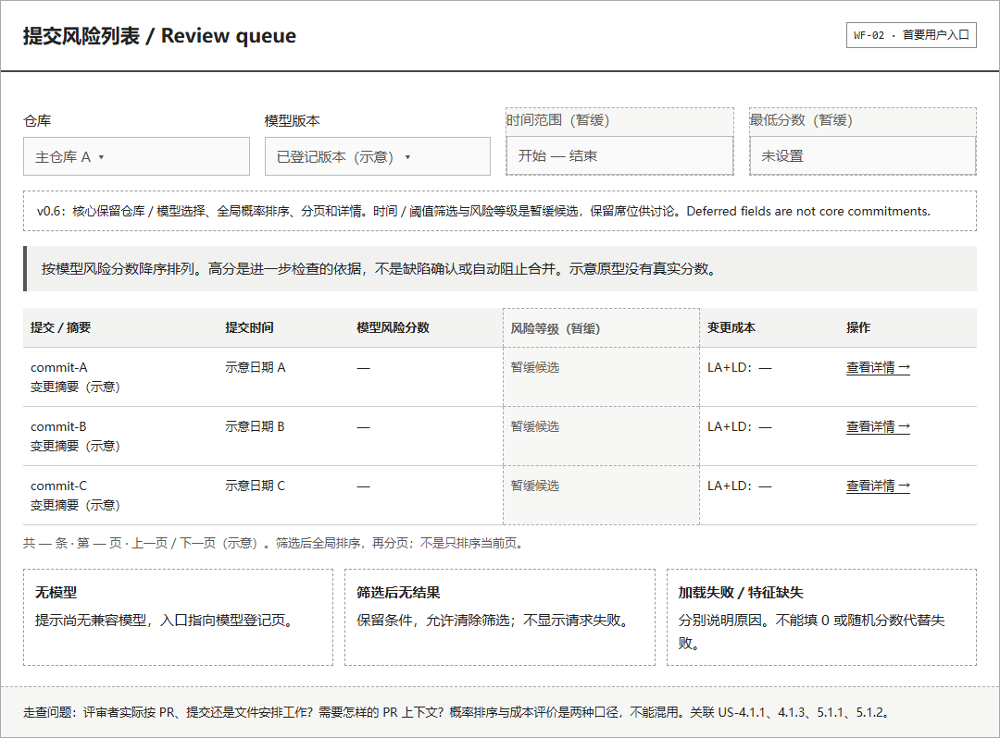
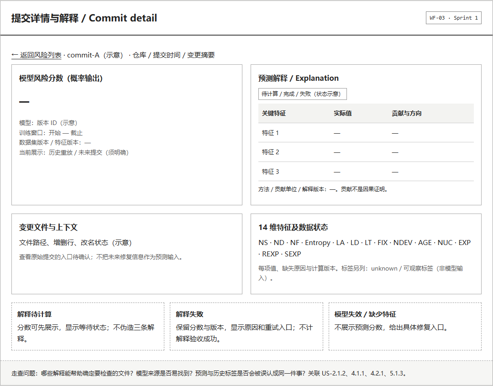
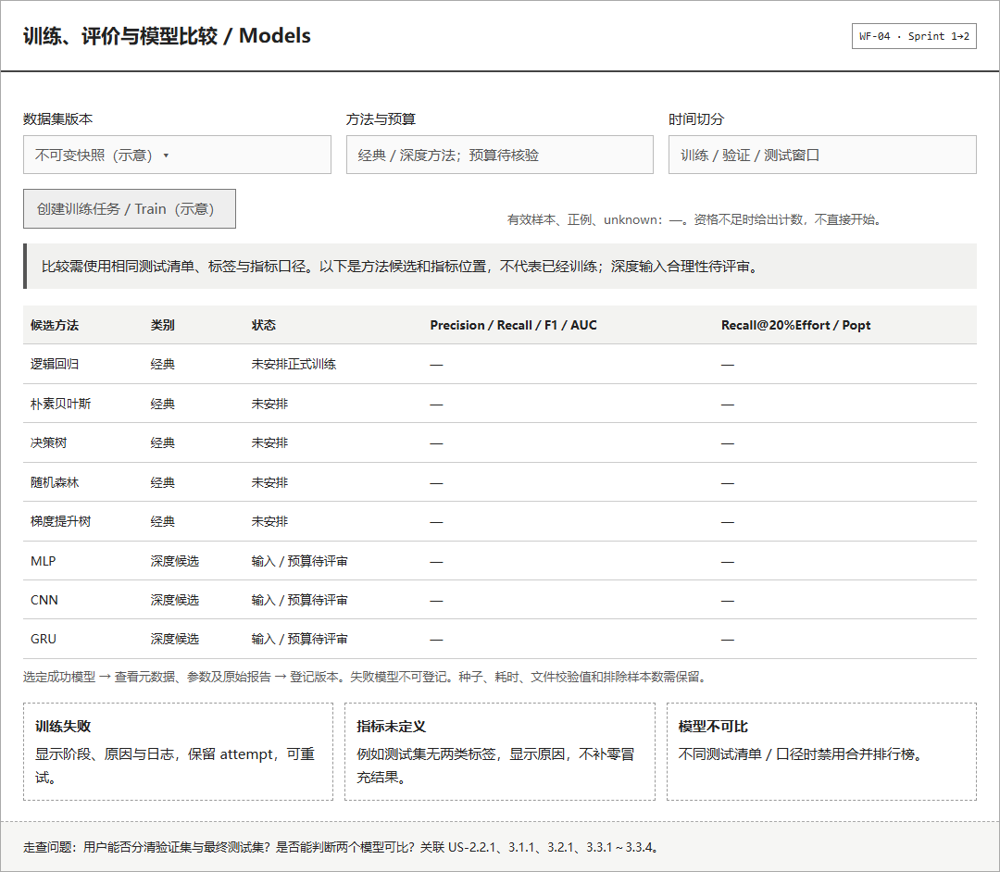
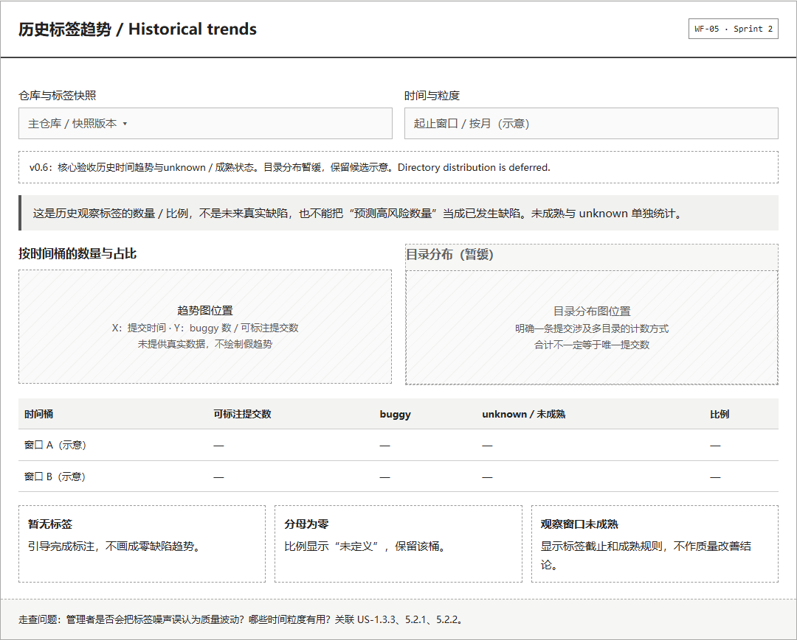

# JIT 缺陷预测系统 —— 产品需求文档

> 按现有课程模板章节组织。当前为可评审草案，不是已经确认的需求基线；有文件、有代码或通过软件测试，均不代表前置工作或 Sprint 验收完成。

---

## 一、版本信息

| 项 | 内容 |
|---|---|
| 产品名称 | JIT 缺陷预测系统 |
| 团队名称 | 厚积薄发 |
| 团队成员 | 荀浩（Scrum Master／组长）、徐卓航（Product Owner）、杨稳曌（研发）、新成员（研发，姓名待补，英语交流） |
| 版本号 | **v0.6.1 范围收敛与设计分析入口草案** |
| 创建日期 | 2026-09-17 |
| 最近更新 | 2026-10-08 |
| 审核人 | 待实际评审；PO 为拟定范围复核人，不代表已经审核 |
| 文档状态 | Sprint 0：需求、调研准备、设计与原型草稿已整理；真实用户调研和团队确认未完成。旧稿 R1／PR 记载未在本轮核验，不能据此宣布需求定稿 |
| 所属课程 | 2026-2027-1 软件开发与测试综合实训 |

**相关文档**

| 文档 | 位置 |
|---|---|
| 团队协作约定 | `docs/团队协作/团队协作约定.md` |
| JIT 学术与竞品调研 | `docs/调研资料/JIT学术与竞品调研_第一周.md` |
| JIT 竞品对比矩阵 | `docs/调研资料/JIT竞品对比矩阵.csv` |
| 四人中英入门指南 | [团队入门指南_中英.md](../团队协作/团队入门指南_中英.md) |
| 当前文档导航与四人分工 | [文档导航](../README.md)，[Sprint 0任务与评审清单](../团队协作/Sprint0前置工作清单.md) |
| 核心流程设计草案 | [核心流程设计_中英.md](核心流程设计_中英.md) |
| 用户调研计划与记录模板 | [用户调研计划与记录模板.md](../调研资料/用户调研计划与记录模板.md) |
| 产品与技术设计 | [产品设计文档.md](产品设计文档.md) |
| 前置工作进度与评审清单 | [Sprint0前置工作清单.md](../团队协作/Sprint0前置工作清单.md) |
| 一页概要与范围拆分 | [项目一页概要](../团队协作/项目一页概要.md)／[核心范围与任务拆分](核心范围与任务拆分.md) |
| 验收测试设计与离线评审 | [验收测试设计](验收测试设计.md)／[评审工作页](../团队协作/评审/评审工作页.html) |
| Sprint 0 设计分析 | [设计分析报告](设计分析报告.md)，在本文附录 D 链接 |
| 真实来源数据可行性 | [ActiveMQ历史数据核查](../数据核查/ActiveMQ数据可行性核查.md)：4个issue、15份来源、8个数据边界案例，非SZZ或训练结果 |
| 本地技术试做（非验收增量） | [本地基线实现与运行.md](../技术试做/本地基线实现与运行.md) |
| 项目仓库 | https://github.com/Sahier-hao/jit-defect-prediction |

---

## 二、变更日志

| 时间 | 版本号 | 变更人 | 主要变更内容 |
|---|---|---|---|
| 2026-09-17 | v0.1 | 荀浩 | 起草初版：问题陈述与价值主张、竞品对比、MVP 边界、6 个 Epic／16 个 Feature／42 条用户故事、4 项非功能需求、待确认问题 |
| 2026-09-17 | v0.2 | 徐卓航 | **R1 需求评审**：修正用户故事优先级统计；补齐 3 条核心故事验收标准；执行 MVP 范围调整 4 项（A-1~A-4）；明确仓库数量边界与预警介入方式；澄清 NFR-1/NFR-2 口径并锁定非功能需求选型；新增评审记录、课程要求对齐校核、待办清单与 Sprint 映射 |
| 2026-09-18 | v0.3 | 荀浩 | **结构对齐课程模板**：重组为课程规定的章节结构；新增版本信息、变更日志、名词解释、用户调研席位、产品流程图与交互原型图席位；功能说明改用课程模板的表格列格式；评审记录移入附录 |
| 2026-10-04 | v0.4 草案 | Codex（按荀浩指示整理） | 更新四人协作信息；新增中英入门、任务清单和核心流程草案引用；8 条 P0 验收补充在配套文档中待复核，未冒充新一轮需求评审 |
| 2026-10-04 | v0.4 技术试做记录 | Codex | 新增 CSV 单基线软件链路并用合成数据验证。根据用户后续澄清，这属于提前开展的技术试做，不表示需求已确认、Sprint 1 已开始或技术栈已批准 |
| 2026-10-04 | v0.5 草案 | Codex（按荀浩澄清整理） | 回到需求与产品设计阶段；补齐 42 条故事的正常与异常验收草案、调研准备、五页低保真原型、架构／数据库／时序设计；统一解释状态，修正范围与排期依赖，所有评审结论及参数确认另行留痕 |
| 2026-10-04 | v0.6 草案 | Codex（按荀浩指示继续整理） | 建议收敛为24条业务＋2条过程，首轮16条链路；保留42条原优先级，暂缓16条候选。补一页概要、12个准备任务、离线评审工作页与14类具体验收测试设计；未替团队确认范围或完成访谈 |
| 2026-10-04 | v0.6 数据核查补充 | Codex（按荀浩指示自主推进） | 获取并复核ActiveMQ真实公开来源；补历史Jira／当前GitHub Issues、固定分支／回补关系、issue类型、集成与标签可得时间、Kamei与SZZ过滤分离；保留24＋2范围，无正式SZZ或训练结论 |
| 2026-10-08 | v0.6.1 设计分析入口草案 | 杨稳曌 | 按课程需求模板在附录增加“设计分析报告”入口；报告仅分析 Sprint 0 需求与候选设计，不把 Sprint 1 技术试做作为依据 |

---

## 三、文档说明

### 3.1 名词解释

| 术语／缩略词 | 说明 |
|---|---|
| **JIT**（Just-in-Time Defect Prediction） | 即时缺陷预测。与传统"文件／模块粒度"的缺陷预测不同，JIT 在**每次代码提交**的粒度上预测该提交是否会引入缺陷 |
| **SZZ 算法** | 一种缺陷标签构造方法，得名于提出者 Śliwerski、Zimmermann 和 Zeller。先从历史提交中识别**缺陷修复提交**，再分析修复涉及的代码行，借助版本历史回溯出**引入缺陷的提交** |
| **候选缺陷修复提交** | 消息关键词或 issue 链接筛出的候选；需核对 issue 类型或其它证据，不能仅凭 fix／bug 字样认定为真实修复 |
| **缺陷引入提交**（bug-inducing commit） | 经 SZZ 回溯认定的、引入了后续被修复代码的提交。**注意：这是"可疑"标签而非绝对事实** |
| **Kamei 14 维** | Kamei 等提出的 14 个代码变更度量元，JIT 研究中应用最广的特征集合，分为分散度、规模、目的、历史、经验五组 |
| **变更度量元** | 描述一次代码变更的量化指标，如修改文件数、增删行数、修改分散程度等 |
| **Effort-unaware 指标** | 不考虑审查成本的评估指标，如 Precision、Recall、F1、AUC，回答"预测准不准" |
| **Effort-aware 指标** | 考虑审查成本预算的评估指标，如 Popt、Recall@20%Effort，回答"同样消耗 20% 的审查成本代理量能覆盖多少缺陷标签"——**本产品价值的直接证据** |
| **Popt** | 比较累积成本—缺陷召回曲线面积的归一化指标；本稿采用全成本范围，排序、成本和未定义情形见设计文档 §5.2 |
| **Entropy** | Kamei 14 维之一，衡量修改在多个文件间的分散程度 |
| **MVP** | Minimum Viable Product，最小可行产品 |
| **Epic／Feature／User Story** | 需求的三级层次：Epic 为业务目标，Feature 为功能模块，User Story 为具体功能点 |
| **SDD**（Specification-Driven Development） | 规范驱动开发，以规范为唯一事实来源，代码是其派生产物 |
| **OpenSpec** | 本课程采用的 SDD 框架，用 Markdown + CLI 管理规范与变更 |
| **Sprint** | Scrum 的迭代周期，本课程每个 Sprint 持续 2-5 周 |

---

## 四、需求背景

### 4.1 产品／数据现状

#### 4.1.1 问题假设

课程要求在提交粒度预测风险，帮助评审者优先审查。本产品的待验证问题是：当评审时间有限且有多个待处理变更时，评审者是否需要额外的排序依据，以及什么信息能帮助其判断下一步检查哪里。

这不是“所有现有工具都无法排序”或“静态分析普遍误报高”的市场事实。团队已有文献／竞品调研，但尚无真实用户访谈，也没有同环境工具对比实验。现有工具、人工经验和项目流程可能已经足够好，这些反例需要记录。

#### 4.1.2 解决思路（草案）

从历史仓库构建标签和特征，训练提交级模型；用户手动选择已解析提交，查看风险分数、模型版本和局部解释，辅助安排评审。首轮不包含实时 Webhook，历史重放必须标注训练窗口，不能声称自动拦截尚未进入仓库的提交。

#### 4.1.3 价值与验证

- 用户价值假设：更容易安排评审顺序并找到需要检查的变更上下文。通过真实访谈和原型走查验证。
- 模型价值假设：同样成本预算下，比随机排序和变更规模基线覆盖更多缺陷标签。通过固定测试清单的 effort-aware 对比验证。
- 不承诺精度提升、减少线上缺陷或概率已经校准；没有证据时不能用这些作为已实现产品价值。

### 4.2 目标用户

| 角色 | 画像 | 核心诉求 | 使用频率 |
|---|---|---|---|
| **代码评审员**（主要用户） | 团队中负责 Code Review 的开发者，每天要处理多个 PR，审查时间有限 | "告诉我先看哪个提交" | 每天 |
| **算法工程师** | 负责训练、评估、迭代预测模型，关注指标和特征有效性 | "让我快速对比模型、定位特征问题" | 每周 |
| **质量／项目管理者** | 关注项目整体质量走势，需要向上汇报 | "给我看缺陷引入的趋势和分布" | 每周 |
| **系统管理员** | 负责接入新仓库、维护流水线与服务 | "让我低成本接入新项目" | 按需 |

> **依据**：课程强调指导评审员优先审查高风险提交，因此本稿提议以代码评审员为首要用户。其工作单位、使用频率和排序痛点仍须访谈验证；不把课程描述当作真实用户确认。
>
> ⚠️ **本节用户画像为基于课程要求与领域常识的推导，尚未经真实用户调研验证**，见 4.3。

### 4.3 用户调研

**状态：准备稿已补，访谈尚未开展，结论为空。** T-11 不能因有访谈提纲而勾成完成。

计划访谈 3–5 位有真实代码评审经验的人，回顾最近一次行为，再走查原型。完整中英提纲、匿名记录模板、假设支持／反对证据表和完成标准见[用户调研计划与记录模板](../调研资料/用户调研计划与记录模板.md)。

| 待验证问题 | 当前证据 | 回填要求 |
|---|---|---|
| 是否需要额外的评审优先级依据 | 课程提出场景；没有用户行为证据 | 真实例子、排序方式、困难及反例 |
| 是否以提交为实际评审单位 | 未访谈 | PR／提交／文件关系及界面影响 |
| 分数和解释如何影响决策 | 未走查 | 参与者理解、信任边界、异步状态反馈 |
| 手动接入／查询是否可接受 | 未访谈 | 可接受步骤、额外负担、与现有流程的关系 |

**调研结论：未采集，不填写虚构访谈、支持率或引用。** 完成后写明实际人数和日期、匿名证据索引、分歧、对应 Story ID，以及调整 MVP 的理由。

### 4.4 竞品与替代方案

依据现有[学术与竞品调研](../调研资料/JIT学术与竞品调研_第一周.md)及[对比矩阵](../调研资料/JIT竞品对比矩阵.csv)，以下为 2026-09-17 调研材料的分类摘要，不代表本轮重新核验产品的最新能力。

| 类别／例子 | 相关能力 | 本项目应借鉴什么 | 表述边界 |
|---|---|---|---|
| 提交级学术工具与方法：Commit Guru、DeepJIT、JITLine | 提交风险预测、度量或代码表示、解释／定位研究 | 复现基线、明确输入与标签、保存实验口径 | 已有直接相关方案，不能声称首创；公开工具可用性未在本轮确认 |
| 历史热点／代码健康：CodeScene、Bugspots、Code Maat | 仓库历史、热点或代码健康分析 | 用户如何理解风险与历史上下文 | 热点不自动等于本项目定义的缺陷概率 |
| 静态质量／安全检查：SonarQube、CodeQL、Semgrep | 规则／分析告警及质量检查 | 告警上下文、定位与处理入口 | 是替代或互补方案，不作无实验依据的误报率比较 |
| 人工／AI 评审流程：GitHub Review、CodeRabbit | 评审协作、变更讨论或 AI 评审 | 对齐用户已有流程，控制额外步骤 | 不断言它们完全没有排序、历史分析或预测能力 |
| 本产品候选定位 | 可追溯仓库数据、两类模型对比、风险列表与解释 | 把成熟方法组织成可运行、可验证的课程产品 | 需要真实调研；效果和收益尚未验证 |

完整资料有 DOI／官方文档出处及各自限制。若要提交“当前产品能力比较”，须再按原来源核验，不能把旧访问日期写成最新事实。

## 五、需求范围

### 5.1 首个 MVP 与最终交付的区别

以下均为范围草案，待调研和团队复核，不把两类八种模型一次塞进首个 MVP。

| 范围层次 | 候选交付 | 完成证据 |
|---|---|---|
| 首个 MVP（Sprint 1） | 一个候选 Java 主仓库，接入／状态 → 解析 → 候选修复与基础 SZZ → 持久化快照和 Kamei 14 维 → 时间切分 → 一个经典基线 → 两类评价与模型登记 → 单条预测、详情与解释、风险列表 | 使用真实仓库的完整可运行演示、数据证据、测试和限制；CSV 合成试做不能替代 |
| 最终核心增量（Sprint 2 完成主要开发） | 两类总计 ≥8 种模型、相同测试集的比较、数据质量与失败重试、标签统计及历史时间趋势；保留首轮主仓库的端到端可复现性 | 全部范围内故事的验收证据、正式数据／效果报告 |
| 测试与验证（Sprint 3） | 修复缺陷、功能／集成／系统测试、至少两项质量验证、文档与规格一致性 | 原始测试记录、缺陷处置、质量测试和已知限制 |
| 暂缓候选 | 16条未选故事（9条P1＋7条P2），包括批量接口、风险等级、高级筛选、目录图、自动流水线等 | 单独评审，不能把原P1优先级当作本期承诺 |

v0.6建议最终选入**24条业务故事＋2条过程故事**，其中首轮业务链路候选16条；完整Backlog仍为42条，P0/P1/P2保持18/17/7。原P0＋P1中的32条业务只是候选池，不再全部列为最终承诺。逐条选择与暂缓理由见[核心范围与任务拆分](核心范围与任务拆分.md)；范围须真实调研与团队复核。课程“≥20个关联核心故事”应靠业务闭环与实际验收，不能靠过程故事凑数。

主仓库暂提Apache ActiveMQ。本轮[真实来源核查](../数据核查/ActiveMQ数据可行性核查.md)已确认4个历史issue及修复／合并／回补、diff和文件快照可取得；当前issue入口为GitHub，旧AMQ记录在Jira。优先以固定main的2024历史案例细化契约，仍未测量仓库体积、整体关联覆盖率或可训练数量。多仓库列表只表示接入管理，不承诺跨项目训练或每个仓库都完成正式效果验证。

### 5.2 范围外（明确不做）

| 不做的事 | 原因 |
|---|---|
| 多语言支持（Python／JS／C++ 等） | 先做透 Java 一种，度量元定义与语言强相关 |
| 预训练语义特征（如 CodeBERT） | 课程标注为「可选」，列为附加功能；CNN／GRU候选的基础diff／消息token序列另在设计§5.3核对输入与预算，不等于引入预训练模型 |
| 实时 Webhook 自动接入 CI | MVP以界面单条查询验证价值，批量API暂缓，实时接入为附加功能（见 5.3 A-3） |
| 多租户与细粒度权限体系 | 单团队使用场景，投入产出比低 |
| 分布式训练与大规模并发 | 数据规模在单机可处理范围 |
| 缺陷自动修复建议 | 超出"预测"定位，属另一个问题域 |
| 模型自动重训练／定时调度／漂移监控 | MVP 无人值守的线上流量，训练为离线批处理，属运维级能力 |

> **范围控制的判断依据**：课程要求明确警告"项目范围过大、无法在各 Sprint 验收会被要求缩减"。上述范围外项若团队认为仍有余力，应作为**附加功能增量**提出，而非塞进 MVP。

### 5.3 范围决策草案

旧稿 A-1～A-4 为范围调整记载，本轮不核验其历史批准状态。当前提议保留其主要方向，重新由团队确认：

| 决策 | 提议 | 需要确认什么 |
|---|---|---|
| A-1 | 风险列表为首轮入口，趋势放 Sprint 2 | 真实主要用户与任务 |
| A-2 | 一个主仓库验证全链路，多仓库仅接入管理 | 主仓库与资源；不宣称 ActiveMQ 体积适中已验证 |
| A-3 | 手动触发单条查询；批量接口暂缓，Webhook可选 | 用户是否接受手动入口；v0.6只修改草案，不宣称历史批准被更改 |
| A-4 | Sprint 3 集中验证，可选功能不挤占测试 | 可选项投入条件与实际人力 |

范围改变时同步 PRD、产品 change、任务和原型，记录理由和复核人；不能以“旧稿已闭环”替代当前确认。

### 5.4 首个 MVP 主链路（草案）

`US-1.1.1/1.1.2 接入与状态 → US-1.2.1 解析 → US-1.3.1 候选修复识别 → US-1.3.2 SZZ → US-1.4.1 持久化 → US-2.1.1 Kamei 14 维 → US-2.2.1 时间切分 → US-3.1.1 首基线 → US-3.3.1/3.3.2 双指标 → US-3.3.4 登记 → US-4.1.1 预测 → US-4.2.1/5.1.3 解释详情 → US-5.1.1 风险列表`

课程要求至少一条从界面／入口到业务与数据层的完整链路。上述是演示目标，不是已完成状态。采集、标签和模型失败时必须展示明确原因；没有真实采集及标签证据时，只能报告技术试做。

## 六、功能详细说明

**优先级定义（草案）**：`P0` = 最终核心必需，具体交付 Sprint 另列｜`P1` = 较重要候选，不自动纳入本期范围｜`P2` = 未承诺的可选增强。下面 42 条均有可测验收草案，不表示已经评审或实现。

### 6.1 产品流程图与时序

[核心流程设计](核心流程设计_中英.md)提供训练、预测与异常路径的 Mermaid 图源及 Story 对照；[设计文档 §3](产品设计文档.md)补充采集训练和预测解释两条时序，§2／§4 给出架构及数据库关系图。状态为本地设计草稿，待人工复核。

### 6.2 交互原型图

[打开五页低保真原型](原型/低保真原型.html)。以下 PNG 为同一 HTML 图源导出，文字与值都是示意占位，未连接模型。不是正式界面实现或用户验证结果。

覆盖正常、空、失败和等待状态，图中标明 Story 和走查问题。原型工具、提示词及待人工复核说明保存在图源页尾；真实走查记录使用调研模板。

### 6.3 功能说明表

> 说明：「模块」对应 Feature，「功能」对应 User Story；验收均为 v0.6 草案；暂缓故事的标准仅供后续选入时使用，正常和异常／边界必须同时验证。WF 编号对应 §6.2；工程故事对应过程记录而非页面。参数未定时查设计文档并保留待评审状态。

#### Epic 1：数据采集与仓库解析

> 业务目标：把真实开源仓库的提交历史变成可训练的、带缺陷标签的结构化数据。

| 序号 | 模块 | 功能 | 功能详细说明 | 交互图 |
|---|---|---|---|---|
| 1 | 仓库接入 | **US-1.1.1** 通过界面填入 Git 仓库地址，系统自动拉取代码历史 | **P0**。作为算法工程师，我想要通过界面填入 Git 仓库地址，以便系统自动拉取代码历史，而不用手工执行命令。 **验收（草案）**：WHEN 提交合法公开仓库地址及有效窗口 THEN 返回任务 ID 并可查询进度；WHEN 地址／窗口无效或仓库无法访问 THEN 显示明确原因，不创建 ready 数据集；WHEN 超资源上限 THEN 指出配置上限并拒绝，不能无限等待 | WF-01 |
| 2 | 仓库接入 | **US-1.1.2** 查看已接入仓库列表及其状态 | **P0**。作为算法工程师，我想要查看已接入仓库的列表及其状态（克隆中／解析中／已就绪／失败），以便掌握数据准备进度。 **验收（草案）**：WHEN 已有接入任务 THEN 列出仓库、阶段、进度及更新时间；WHEN 任务失败 THEN 保留失败原因和重试入口；WHEN 无仓库 THEN 显示接入指引，不显示空白页面 | WF-01 |
| 3 | 仓库接入 | **US-1.1.3** 对克隆失败的仓库重试或删除 | **P1**。作为系统管理员，我想要对克隆失败的仓库重试或删除，以便清理无效数据、释放存储 **验收（草案）**：WHEN 重试失败任务 THEN 新建 attempt 并保留旧失败记录；WHEN 删除失败草稿 THEN 清理该任务的未引用数据；WHEN 仍有训练／模型引用或任务运行中 THEN 阻止删除并说明依赖 | WF-01 |
| 4 | 提交历史解析 | **US-1.2.1** 解析每个提交的元数据 | **P0**。作为算法工程师，我想要系统解析每个提交的元数据（作者、时间、变更文件、增删行数），以便作为特征计算的输入。 **验收（草案）**：WHEN 解析固定窗口 THEN 保存提交ID、父提交、author／committer时间、匿名作者、变更路径及增删行，并记录目标分支／固定ref和可得的集成事件；计数与过滤日志一致；WHEN 遇到二进制或不可解析提交 THEN 记录状态与原因，不静默填数或中断所有提交 | WF-01 |
| 5 | 提交历史解析 | **US-1.2.2** 自动过滤合并提交与纯格式变更 | **P1**。作为算法工程师，我想要系统自动过滤合并提交与纯格式变更（如仅改空白、注释），以便减少噪声样本、提升标签质量 **验收（草案）**：WHEN 开启固定版本过滤规则 THEN 合并与纯格式变更按规则排除并统计；WHEN 同时含逻辑和空白修改 THEN 不能整条当纯格式变更排除；WHEN 无法判断 THEN 保留并标记待核对 | WF-01 |
| 6 | 缺陷标注（SZZ） | **US-1.3.1** 自动识别缺陷修复提交 | **P0**。作为算法工程师，我想要系统自动识别缺陷修复提交（依据 commit message 中的 issue 编号或缺陷关键词），以便构建初始标签。 **验收（草案）**：WHEN 提交消息关键词或issue键匹配 THEN 生成候选，记录tracker、类型／状态历史、来源哈希及分页完整性；WHEN 仅Fixed但类型非Bug或issue键只出现在diff中 THEN 不作为本规则下已核对Bug修复；WHEN 来源不可得、分页不全或关联不明 THEN 待核对并统计，不直接赋引入标签 | WF-01 |
| 7 | 缺陷标注（SZZ） | **US-1.3.2** 执行 SZZ 算法回溯引入缺陷的提交 | **P0**。作为算法工程师，我想要系统执行 SZZ 算法回溯出可能引入缺陷的提交，以便得到训练所需的标签。 **验收（草案）**：WHEN 对确认规则下的候选执行 SZZ THEN 保存fix、可疑引入提交、目标分支、旧路径／行号、算法及过滤版本、证据与可得时间；merge／backport来源关系保留，不能重复归因同一主分支修复；WHEN 无法回溯 THEN 保存无法归因原因并统计，不视为 clean；WHEN 重命名／合并不支持 THEN 明确限制 | WF-01 |
| 8 | 缺陷标注（SZZ） | **US-1.3.3** 查看标注结果统计 | **P1**。作为算法工程师，我想要查看标注结果统计（缺陷提交占比、回溯成功／失败数、无法归因的修复提交），以便判断数据质量是否可训练 **验收（草案）**：WHEN 查看固定标签快照 THEN 展示 buggy、clean_observed、unknown、排除及回溯成功／失败数，计数可核对；WHEN 无可标注样本 THEN 比例显示未定义，不展示 0% 作为高质量结论 | WF-01 |
| 9 | 数据持久化 | **US-1.4.1** 解析结果持久化到数据库 | **P0**。作为算法工程师，我想要解析结果持久化到数据库，以便重复训练时无需重新克隆和解析。 **验收（草案）**：WHEN 采集成功并持久化 THEN 重启后可读取同一快照且来源哈希一致；WHEN 同一提交重复导入 THEN 不产生重复主记录；WHEN 写入中断 THEN 不产生 ready 半成品，保留失败 attempt | WF-01 |
| 10 | 数据持久化 | **US-1.4.2** 数据异常时重建指定仓库数据集 | **P2**。作为系统管理员，我想要在数据异常时重建指定仓库的数据集，以便从损坏状态恢复 **验收（草案）**：WHEN 重建指定仓库 THEN 创建新版本并保留旧引用快照；WHEN 重建失败 THEN 原成功数据集仍可读取；WHEN 试图覆盖被模型引用的快照 THEN 拒绝并说明原因 | WF-01 |

#### Epic 2：特征工程与样本构建

> 业务目标：把原始提交转换成模型可消费的特征向量与标签。

| 序号 | 模块 | 功能 | 功能详细说明 | 交互图 |
|---|---|---|---|---|
| 11 | 变更度量元 | **US-2.1.1** 自动计算 Kamei 14 维代码变更度量元 | **P0**。作为算法工程师，我想要系统自动计算 Kamei 14 维代码变更度量元，以便作为模型的标准输入特征。 **验收（草案）**：WHEN 计算固定版本 Kamei 特征 THEN 14个字段齐全，单位／公式／文件范围可查且重复计算一致；Kamei文件范围与SZZ归因范围分别版本化；WHEN 历史不足或解析失败 THEN 记录有效性与原因，不能静默填零；WHEN 计算历史特征 THEN 不读取该提交之后的信息 | WF-03／WF-04 |
| 12 | 变更度量元 | **US-2.1.2** 查看单个提交的 14 维特征明细 | **P1**。作为算法工程师，我想要查看单个提交的 14 维特征明细，以便核查计算逻辑是否正确 **验收（草案）**：WHEN 打开提交特征明细 THEN 列出 14 个名称、值、单位、版本和历史截止；WHEN 特征缺失 THEN 显示原因而非 0；WHEN 提交不存在 THEN 明确报错 | WF-03／WF-04 |
| 13 | 变更度量元 | **US-2.1.3** 以插件方式新增自定义度量元 | **P2**。作为算法工程师，我想要以插件方式新增自定义度量元，以便在不改动核心代码的前提下扩展特征集 **验收（草案）**：WHEN 注册合法度量插件 THEN 新特征进入新 schema 版本且原模型仍按原 schema 工作；WHEN 名称冲突／返回非法值 THEN 拒绝或标记失败，不能覆盖核心 14 维 | WF-03／WF-04 |
| 14 | 样本集构建 | **US-2.2.1** 按时间顺序切分训练集与测试集 | **P0**。作为算法工程师，我想要按时间顺序切分训练集与测试集，以便模拟"用历史预测未来"的真实场景。 **验收（草案）**：WHEN 切分合格快照 THEN 训练时间严格早于测试且相同时间戳不跨边界；训练标签在截止已可得，核对所需分支集成与issue历史证据；缺少历史可得性保持unknown，拟合／调参仅用训练期；WHEN 样本／类别不足或边界无效 THEN 拒绝并报告计数，不能退回随机切分 | WF-03／WF-04 |
| 15 | 样本集构建 | **US-2.2.2** 剔除特征不完整的样本 | **P1**。作为算法工程师，我想要剔除特征不完整的样本，以便保证模型输入质量，并知道剔除了多少 **验收（草案）**：WHEN 样本存在必需特征缺失／非有限数 THEN 按固定策略排除并报告逐类计数；WHEN 全部被排除 THEN 阻止训练并解释；WHEN 仅标签 unknown THEN 单独统计，不把它改成 0 | WF-03／WF-04 |
| 16 | 样本集构建 | **US-2.2.3** 查看数据集的类别分布 | **P1**。作为算法工程师，我想要查看数据集的类别分布（缺陷／非缺陷比例），以便判断是否需要处理类别不平衡 **验收（草案）**：WHEN 查看数据集或分区 THEN 展示有效数量、正／负／unknown 及比例，合计可追溯；WHEN 分母为零 THEN 显示未定义；WHEN 重新切分 THEN 分区统计随清单版本更新 | WF-03／WF-04 |

#### Epic 3：模型训练与评估

> 业务目标：训练多类模型并给出可信的对比结论，支撑"选哪个模型上线"的决策。

| 序号 | 模块 | 功能 | 功能详细说明 | 交互图 |
|---|---|---|---|---|
| 17 | 经典机器学习模型 | **US-3.1.1** 一键训练多种经典模型 | **P0**。作为算法使用者，我想要训练多种经典方法（候选逻辑回归、朴素贝叶斯、决策树、随机森林、梯度提升树），以便在同一测试清单上比较。方法组合待评审，课程要求经典／深度两类总计≥8种。 **验收（草案）**：WHEN 选定合格快照及经典方法 THEN 保存参数、种子、时间边界和真实训练输出；首轮至少一方法成功，最终与深度类合计≥8种；WHEN 参数无效／超预算／训练失败 THEN 保留失败原因，不能登记可用模型 | WF-04 |
| 18 | 经典机器学习模型 | **US-3.1.2** 调整超参数并重新训练 | **P1**。作为算法工程师，我想要调整超参数并重新训练，以便针对本项目数据优化性能 **验收（草案）**：WHEN 修改合法超参数重训 THEN 产生新 run／版本，原结果不覆盖；WHEN 用最终测试集选择参数或参数超范围 THEN 拒绝并指出问题；WHEN 参数相同 THEN 可核对完整配置和种子 | WF-04 |
| 19 | 经典机器学习模型 | **US-3.1.3** 查看训练过程日志与耗时 | **P2**。作为算法工程师，我想要查看训练过程日志与耗时，以便定位慢环节和失败原因 **验收（草案）**：WHEN 任务开始至结束 THEN 保存阶段、耗时、配置和失败原因；WHEN 失败或中断 THEN 日志仍可查看且不记成功；WHEN 查看日志 THEN 不展示凭据内容 | WF-04 |
| 20 | 深度学习模型 | **US-3.2.1** 训练基于提交变更的深度学习模型 | **P0**。作为算法使用者，我想要训练明确输入的深度方法（候选MLP／CNN／GRU，输入方案见设计§5.3），以便与经典方法对比。两类总计≥8种，具体组合与预算待评审。 **验收（草案）**：WHEN 训练确认的深度方法 THEN 使用明确合理的变更输入、保存预处理与资源记录，并与经典类总计≥8种；WHEN 数据／词表／张量不兼容或预算不足 THEN 明确失败，不用同一模型改名称充数量 | WF-04 |
| 21 | 深度学习模型 | **US-3.2.2** 指定训练轮数与批大小 | **P1**。作为算法工程师，我想要指定训练轮数与批大小，以便在可接受时间内完成训练 **验收（草案）**：WHEN 指定合法 epoch／batch 与预算 THEN 实际训练遵守并记录早停原因；WHEN 非正整数／超上限 THEN 校验拒绝；WHEN 超时 THEN 停止并标记未完成，不补最终指标 | WF-04 |
| 22 | 评估与对比 | **US-3.3.1** 查看每个模型的 Effort-unaware 指标 | **P0**。作为算法工程师，我想要查看每个模型的 Effort-unaware 指标（Precision／Recall／F1／AUC），以便了解整体预测能力。 **验收（草案）**：WHEN 对固定测试清单评价 THEN 同时报告 Precision、Recall、F1、AUC、阈值及混淆计数；WHEN 测试集仅一类或指标分母为零 THEN 按口径返回未定义及原因，不能伪造 AUC 或提升结果 | WF-04 |
| 23 | 评估与对比 | **US-3.3.2** 查看 Effort-aware 指标 | **P0**。作为算法工程师，我想要查看 Effort-aware 指标（如 Popt、Recall@前 20% 工作量），以便评估在真实审查场景下的实际收益。 **验收（草案）**：WHEN 评价相同快照 THEN 同时给出两类指标、成本代理、排序、20%实际预算和全范围 Popt；WHEN 测试清单／标签／指标口径不同 THEN 禁止混合比较；WHEN 无正例或归一化退化 THEN 显示未定义及原因 | WF-04 |
| 24 | 评估与对比 | **US-3.3.3** 查看模型对比表与对比图 | **P1**。作为算法工程师，我想要查看模型对比表与对比图，以便快速选出上线模型 **验收（草案）**：WHEN 选择可比模型 THEN 表与图使用相同清单和两组指标，能查看原报告；WHEN 不可比 THEN 列明差异而不合成排名；WHEN 某模型失败或指标未定义 THEN 保留状态而不当零分结果 | WF-04 |
| 25 | 评估与对比 | **US-3.3.4** 将选定模型保存并登记版本 | **P0**。作为算法工程师，我想要将选定模型保存并登记版本（含训练数据范围、参数、指标），以便上线使用且结果可复现。 **验收（草案）**：WHEN 登记成功模型 THEN 保存数据哈希、时间／标签截止、schema、参数、种子、依赖、指标口径与文件校验值，重启可读取；WHEN 文件缺失／校验失败或训练失败 THEN 不列为 ready；WHEN 重训 THEN 新建版本 | WF-04 |

#### Epic 4：预测与解释

> 业务目标：把训练好的模型变成评审员能用的判断依据。

| 序号 | 模块 | 功能 | 功能详细说明 | 交互图 |
|---|---|---|---|---|
| 26 | 在线预测 | **US-4.1.1** 输入或选择提交并获得缺陷概率 | **P0**。作为代码评审员，我想要输入或选择一个提交并获得缺陷概率，以便判断是否优先审查。 **验收（草案）**：WHEN 选择有完整兼容特征的提交与 ready 模型 THEN 返回有限 [0,1] 分数、预测 ID、模型版本及解释状态；WHEN 无特征、模型缺失／失效或 schema 不匹配 THEN 返回原因，不给默认分数；历史重放标明训练窗口 | WF-03 |
| 27 | 在线预测 | **US-4.1.2** 通过 API 批量提交获取预测结果 | **P1**。作为系统管理员，我想要通过 API 批量提交提交列表获取预测结果，以便集成到 CI 流程 **验收（草案）**：WHEN 合法批量请求 THEN 按请求顺序返回每项提交 ID、分数／版本或错误；WHEN 部分项失败 THEN 不丢项、不用默认值补齐；WHEN 超条数上限或模型失效 THEN 校验拒绝并给出原因 | API用例（暂缓） |
| 28 | 在线预测 | **US-4.1.3** 看到每个提交的风险等级 | **P1**。作为代码评审员，我想要看到每个提交的风险等级（高／中／低），而不只是一个数字，以便快速决策 **验收（草案）**：WHEN 分数可用 THEN 按已版本化阈值显示等级及规则来源；WHEN 分数恰等于边界 THEN 按明确定义归类；WHEN 无分数 THEN 不标低风险；阈值改变不能修改历史记录的原规则 | WF-02／WF-03 |
| 29 | 可解释性 | **US-4.2.1** 看到影响本次预测的关键特征及其方向 | **P0**。作为代码评审员，我想要看到影响本次预测的关键特征及其方向（如"变更文件数偏多"推高风险），以便理解风险来源、有针对性地审查。 **验收（草案）**：WHEN 成功预测 THEN 显示明确解释状态；ready 后至少有3个真实特征贡献、方向、方法和单位，零贡献如实标注；WHEN 未缓存 THEN 显示 pending 并可查询；WHEN 失败／超时 THEN 给原因和重试入口，不伪造解释或算通过 | WF-03 |
| 30 | 可解释性 | **US-4.2.2** 看到全局特征重要度排序 | **P1**。作为算法工程师，我想要看到全局特征重要度排序，以便优化特征工程 **验收（草案）**：WHEN 查看模型全局重要度 THEN 显示方法、数据范围、单位及排名；WHEN 仅有局部解释 THEN 不能冒充全局结果；WHEN 方法不支持或计算失败 THEN 明确状态，不混合不同单位作排名 | WF-03 |

#### Epic 5：可视化前端

> 业务目标：让不同角色在 10 秒内看到自己关心的信息。

| 序号 | 模块 | 功能 | 功能详细说明 | 交互图 |
|---|---|---|---|---|
| 31 | 风险列表 | **US-5.1.1** 看到按缺陷概率降序排列的提交列表 | **P0**。作为代码评审员，我想要看到按缺陷概率降序排列的提交列表，以便优先审查高风险提交。 **验收（草案）**：WHEN 打开有可用结果的列表 THEN 按概率全局降序后分页，显示提交时间、分数和模型来源；若后续启用等级，另附版本化规则；WHEN 翻页 THEN 顺序及仓库／模型选择保持一致；WHEN 无仓库／模型／特征 THEN 有明确下一步，服务错误不伪装成无结果 | WF-02／WF-03 |
| 32 | 风险列表 | **US-5.1.2** 按仓库、时间范围、概率阈值筛选列表 | **P1**。作为代码评审员，我想要按仓库、时间范围、概率阈值筛选列表，以便聚焦当下关心的范围 **验收（草案）**：WHEN 设置仓库、时间与分数筛选 THEN 仅返回匹配记录且总数准确，条件随分页保留；WHEN 起止倒置或阈值超范围 THEN 指出错误；WHEN 无匹配 THEN 允许清除条件，不改成所有数据 | WF-02／WF-03 |
| 33 | 风险列表 | **US-5.1.3** 点击列表项查看该提交的详情 | **P1**。作为代码评审员，我想要点击列表项查看该提交的详情（变更文件、特征、归因），以便决定是否深入审查 **验收（草案）**：WHEN 点击提交 THEN 展示同一提交与模型版本的上下文、特征、解释状态和返回入口；WHEN 切换模型／提交 THEN 旧响应不能覆盖当前详情；WHEN 数据不存在 THEN 显示原因，不展示上一条详情 | WF-02／WF-03 |
| 34 | 趋势看板 | **US-5.2.1** 看到缺陷引入数量和比例随时间的变化趋势 | **P1**（候选 Sprint 2 交付）。作为质量管理者，我想要看到缺陷引入数量和比例随时间的变化趋势，以便评估质量走势 **验收（草案）**：WHEN 查询固定标签快照及时间桶 THEN 展示历史 buggy 数／可标注提交比例、unknown、窗口与规则；WHEN 分母为零 THEN 比例未定义；WHEN 标签未成熟 THEN 标注限制，不能把预测高风险数当真实缺陷数 | WF-05 |
| 35 | 趋势看板 | **US-5.2.2** 看到缺陷按模块／目录的分布 | **P1**。作为质量管理者，我想要看到缺陷按模块／目录的分布，以便定位问题集中的区域 **验收（草案）**：WHEN 查看目录分布 THEN 按明确的多目录计数规则展示标签数量及唯一提交数；WHEN 一提交涉及多个目录 THEN 说明重复计数；WHEN 路径缺失 THEN 单独统计，不悄悄归入默认目录 | WF-05 |
| 36 | 趋势看板 | **US-5.2.3** 看到模型性能指标概览 | **P2**。作为质量管理者，我想要看到模型性能指标概览，以便了解预测结果本身的可信度 **验收（草案）**：WHEN 展示模型概览 THEN 带测试窗口、清单版本、两组指标及原报告入口；WHEN 无评价或不适用指标 THEN 显示状态与原因；WHEN 数据窗口不同 THEN 不宣称性能改善 | WF-05 |
| 37 | 趋势看板 | **US-5.2.4** 看到高风险提交的贡献者分布 | **P2**。作为代码评审员，我想要看到高风险提交的贡献者分布，以便安排评审资源 **验收（草案）**：WHEN 查看贡献者分布 THEN 使用匿名作者键并说明这是模型高风险数量而非缺陷确认；WHEN 别名合并 THEN 固定映射版本；WHEN 作者未知 THEN 单列 unknown，不用于个人能力排名 | WF-05 |

#### Epic 6：工程化

> 业务目标：让系统可持续演进，且开发过程本身留下可核验的证据。

| 序号 | 模块 | 功能 | 功能详细说明 | 交互图 |
|---|---|---|---|---|
| 38 | 协作规范与过程留痕 | **US-6.1.1** 按分支规范开发并通过 PR 合并 | **P0**。作为团队成员，我想要按分支规范开发并通过 PR 合并（合并前经非作者审阅），以便留下可核验的个人贡献记录。 **验收（草案）**：WHEN 实际进行协作评审 THEN 留下 Story／change、验证和非作者审阅证据；WHEN 只有作者自审或仍有未解决意见 THEN 不计已完成评审；本轮仅整理文档，不执行 Git 或创建远端记录 | 过程／配置记录，不适用页面 |
| 39 | 协作规范与过程留痕 | **US-6.1.2** 需求变更时同步更新 OpenSpec 记录 | **P0**。作为团队成员，我想要需求变更时同步更新 OpenSpec 记录，以便规格与实现始终一致。 **验收（草案）**：WHEN 需求发生变更 THEN 同步 PRD、change 的规格／设计／任务及验收映射；WHEN 任务勾选但无运行／验收证据 THEN 不算功能合格；WHEN 最终归档 THEN 当前规格与产品一致，未批准草案不当基线 | 过程／配置记录，不适用页面 |
| 40 | CI/CD | **US-6.2.1** 在提交或 PR 时自动执行构建与测试 | **P1**。作为开发者，我想要在提交或 PR 时自动执行构建与测试，以便及早发现问题 **验收（草案）**：WHEN 启用自动检查并触发 THEN 记录构建与关键测试输出；WHEN 故意引入检查失败 THEN 流程报失败而不发布；WHEN 依赖或配置变更 THEN 仍可复现锁定环境，启用前不宣称有流水线 | 过程／配置记录，不适用页面 |
| 41 | CI/CD | **US-6.2.2** 在 CI 中执行 OpenSpec 规范校验 | **P2**。作为开发者，我想要在 CI 中执行 OpenSpec 规范校验，以便结构不合格的规范被拦截 **验收（草案）**：WHEN 校验有效规格 THEN 检查通过并留存结果；WHEN 缺少需求／Scenario 或格式非法 THEN 检查失败且可定位；WHEN 校验通过 THEN 只代表结构合格，不替代业务验收 | 过程／配置记录，不适用页面 |
| 42 | 服务部署 | **US-6.3.1** 通过容器化方式部署整个系统 | **P2**。作为系统管理员，我想要通过容器化方式部署整个系统，以便一键启动全部服务 **验收（草案）**：WHEN 按部署说明启动容器 THEN 前端、服务和数据层可访问且版本可查；WHEN 重启 THEN 持久化数据保留；WHEN 配置／依赖缺失 THEN 有明确错误，不创建不可追溯模型 | 过程／配置记录，不适用页面 |

#### 6.3.1 用户故事统计

| Epic | Feature 数 | Story 数 | P0 | P1 | P2 |
|---|---|---|---|---|---|
| 1 数据采集与仓库解析 | 4 | 10 | 6 | 3 | 1 |
| 2 特征工程与样本构建 | 2 | 6 | 2 | 3 | 1 |
| 3 模型训练与评估 | 3 | 9 | 5 | 3 | 1 |
| 4 预测与解释 | 2 | 5 | 2 | 3 | 0 |
| 5 可视化前端 | 2 | 7 | 1 | 4 | 2 |
| 6 工程化 | 3 | 5 | 2 | 1 | 2 |
| **合计** | **16** | **42** | **18** | **17** | **7** |

上表按故事正文重算，P0／P1／P2 为 18／17／7；后续调整同步统计与范围。

**草案完整性**：42/42 条已写正常和异常／边界验收，18/18 条 P0 均有草案。**确认状态**：待实际团队评审，不能把草案覆盖率当作需求已批准、测试覆盖率或功能完成率。P0+P1中有32条业务候选；v0.6从中建议选择24条，另选2条过程；其余16条故事暂缓，不自动纳入承诺。

---

## 七、非功能需求

课程要求至少落实两项质量需求。旧稿提议性能 + 可解释性，本轮建议增加可靠性作为第二项可独立验证的质量属性；是否接受解释完整性作为 NFR、最终选哪两项及硬件／负载均待确认。

| ID | 质量属性／目标草案 | 验证口径 | 状态 |
|---|---|---|---|
| NFR-1 | 性能：预测响应 P95 <2秒；固定1万提交解析 <30分钟 | 至少200次预热后单并发请求；报告原始时延、错误和环境。解析不含网络获取，SZZ／特征／全链路另报，见设计 §6 | 待选型／实测，不是已达标 |
| NFR-2 | 解释完整性：每个成功预测最终至少3项真实贡献、方向、方法和单位 | 分模型抽样；pending 可查询，候选完成上限30秒；失败／超时计失败 | 功能必需；是否计入第二项质量需求待核对 |
| NFR-3 | 可靠性：任务失败可追溯／重试，无 ready 半成品；重启模型仍可用 | 中断、写入失败、模型损坏和重启验证，记录前后状态及文件校验值 | 建议与性能组成两项正式质量验证，待确认 |
| NFR-4 | 易用性：有 ready 数据与模型时，首次预测并找到模型来源≤5分钟 | 至少3位非开发者、无手册／提示，逐人计时和记录困惑；静态原型不算 | 补充候选，未执行 |

**统一解释时序**：预测先返回分数、模型版本及解释状态；缓存命中时可一起返回解释，未命中时返回 pending 并建立任务。解释 ready 后才算满足完整性，失败不能靠“计算中”永久占位。性能统计包含查询和状态返回，异步解释完成时长另报。所有数值是评审候选，必须结合真实硬件和模型资源核对。

本地／内网形态不自动证明安全；部署范围改变时重新评估访问控制。正式验证计划与证据字段见[设计文档 §6](产品设计文档.md)。

## 八、项目规划

### 8.1 Sprint 映射（候选，待实际教学周核对）

| 阶段 | 课程周期 | 目标与依赖 | 候选故事 |
|---|---|---|---|
| Sprint 0 | 第1–3周 | 真实调研、需求范围与验收评审、架构／数据库／流程／时序／原型、看板和产品 OpenSpec 提案 | 本轮正在补草案，尚未达到定稿条件 |
| Sprint 1 | 第4–6周 | §5.4 首链路；仓库状态、两组指标、详情与版本来源随链路完成，不能拖到测试期才补 | US-1.1.1/1.1.2、1.2.1、1.3.1/1.3.2、1.4.1、2.1.1、2.2.1、3.1.1首模型、3.3.1/3.3.2/3.3.4、4.1.1/4.2.1、5.1.1/5.1.3 |
| Sprint 2 | 第7–9周 | 补足两类≥8模型、比较／历史时间趋势、数据质量与失败重试等已选范围；核心开发尽量在本阶段完成 | 其余已选 P0／P1；可选项需单独评审 |
| Sprint 3 | 第10–14周 | 功能、集成、系统与至少两项质量验证，缺陷处置和文档一致性；不以首次开发核心功能作为目标 | 全部已选故事复验；工程协作／规格同步贯穿各阶段 |
| Final | 第15–16周 | 可运行系统、全部范围内变更／当前规格一致、测试报告和答辩材料 | 未开始；不以当前代码试做认定进入该阶段 |

### 8.2 当前前置工作

具体本地看板、产物、状态、完成标准和评审议程见[Sprint 0 前置工作清单](../团队协作/Sprint0前置工作清单.md)。旧稿“第2周／第3周”是课程阶段安排，不能当作今天的实际教学周或已执行截止。

推进顺序：访谈与原型走查 → 修订目标用户和首轮范围 → 评审验收／数据口径与技术设计 → 确认产品 change 和看板 → 进入范围内实现。无需等待材料全都完美才讨论，但需要留下实际的决定及证据。

现有 `add-offline-risk-baseline` 为技术试做记录，不能代替全产品需求基线。未开展真实采集、标签验证或用户调研。

### 8.3 遗留风险与已知限制

| # | 风险／限制 | 影响 | 应对 |
|---|---|---|---|
| RK-1 | MVP 无 CI/Webhook 实时接入，预警依赖人工触发 | 价值主张弱于"自动拦截" | 已在 5.3 A-3 限定表述，并在演示中明确说明为附加功能 |
| RK-2 | 无鉴权与多租户，不做安全性非功能验证 | 无法回答"安全类非功能需求" | 候选演示限定单机／内网；部署边界改变重新评估 |
| RK-3 | 预测能力上限由开源仓库历史数据与 issue 规范决定 | 指标可能低于论文报告值 | 在报告中如实给出数据质量统计与基线对比，不夸大结论 |
| RK-4 | 深度学习模型样本量与算力受限 | 深度模型可能不如经典模型 | 这本身即是可汇报的实验结论；在固定测试清单下报告重复运行结果与限制 |
| RK-5 | 8 个模型的训练与调参时间成本高 | Sprint 2 有超期风险 | 按 T-7 约束训练预算；必要时下调超参搜索范围而非削减模型数量（模型数量是课程硬性要求） |

---

## 附录

### 附录 A：历史 R1 记载与当前校核

**A.1／A.2 保留旧稿记载，不在本轮核验评审者、会议、PR 或批准事实。用户已澄清前置工作尚未完成，因此以正文 v0.6 和当前清单为准；历史“已修正”可表示文字已调整，不能自动表示团队已同意。**

#### A.1 评审信息

| 项 | 内容 |
|---|---|
| 评审轮次 | R1（Sprint 0 第 1 周） |
| 评审对象 | 本文档 v0.1（起草稿） |
| 评审日期 | 2026-09-17 |
| 评审执行 | AI 辅助走查 + 统计量复核（由团队发起的评审轮次）；结论经团队确认后生效 |
| 评审依据 | 课程项目要求；Kamei et al., TSE 39(6), 2013；团队可投入的人力与 Sprint 0-3 周期 |
| 评审方法 | 逐节走查 + 与课程硬性要求逐条对照（见 A.3）+ 统计量重算 |
| 评审结论 | 旧稿记载“有条件通过”；本轮不据此认定需求已确认，当前需实际评审 |
| 评审留痕 | 旧稿记载 GitHub PR #1；未在本轮查看或核验，不认定实际 Approve 状态 |

#### A.2 评审发现与处理

严重度：`B` = 阻塞｜`M` = 重要｜`S` = 建议

| ID | 严重度 | 位置 | 问题 | 处理结论 |
|---|---|---|---|---|
| R1-01 | B | 用户故事统计 | 统计表与正文不符：正文实际为 P0 19／P1 16／P2 7，表中写作 21／15／6，且 Epic 2、Epic 3 的分行计数亦错 | **已修正**为 18／17／7（见 6.3.1） |
| R1-02 | B | 用户故事 | 42 条中仅 7 条有验收标准（17%），P0 中仅 7/19 | **已补** 3 条（US-4.1.1、US-5.1.1、US-6.1.1）；其余 8 条 P0 列入 A.4 待办 |
| R1-03 | B | 5.1 vs US-1.1.2／US-1.1.3 | 范围写"单一 Java 仓库接入"，故事却要求"仓库列表""重试或删除"——边界自相矛盾 | **已明确**（5.3 A-2） |
| R1-04 | M | 4.1.2 vs 5.1／5.2 | 价值主张是"提交合并进主干之前预警"，但 MVP 不含 CI/Webhook 接入 | **已补**入 5.3 A-3 |
| R1-05 | M | 评估与对比 | Effort-aware 指标未定义 **effort 代理变量**与基线，不可复现、不可验收 | **待补**（T-3） |
| R1-06 | M | US-2.2.1 | 只写"按时间切分"，未给切分点与比例 | **待补**（T-4） |
| R1-07 | M | 缺陷标注 | "无法归因"样本未说明是否进入训练集 | **待补**（T-5） |
| R1-08 | M | 第七节 NFR-1／NFR-2 | SHAP 解释与"单次预测 P95 < 2 秒"可能冲突 | **已澄清**（见第七节） |
| R1-09 | M | CI/CD、服务部署 | 附加功能排在「Sprint 3」，与课程对该阶段的定位冲突 | **已修正**（5.3 A-4） |
| R1-10 | M | 5.1、仓库接入 | MVP 无**最小数据量门槛**，可能样本不足导致无法训练 | **待补**（T-6） |
| R1-11 | S | 全文 | 课程原文写作 "Effort-**unware**"，文档写作 "Effort-**unaware**" | **保留**文档正确拼写，A.3 注明课程原文为笔误 |
| R1-12 | S | 经典／深度模型 | 8 个模型重复训练的时间成本未约束 | **待补**（T-7） |
| R1-13 | S | 评估与对比 | 类别不平衡与随机性未约束，对比结论可能不稳定 | **待补**：报告缺陷样本占比；固定随机种子并重复 ≥ 3 次，报告均值与标准差 |
| R1-14 | S | 工程化 | 课程中的"缺陷管理工具"要求无落点 | **待补**（T-9） |

#### A.3 当前课程要求对照（2026-10-04）

依据课程项目要求 PDF 第1–4页。**草案覆盖、真实验证和团队确认是三种不同状态。**

| 要求 | 当前落点 | 草案／当前状态 | 尚缺证据 |
|---|---|---|---|
| 3–4人及个人贡献记录 | §1、协作约定 | 四人信息已整理 | 新成员姓名、任务认领和实际贡献记录 |
| 明确用户、真实场景与价值 | §4、调研模板 | 假设与调研准备 | 真实访谈、走查和范围调整 |
| 清晰 MVP 和可选项 | §5 | 首轮与最终增量已分开 | 团队确认、资源核对 |
| ≥20个关联核心故事，逐条优先级与验收 | §6 | 42条草案；建议24条业务＋2条过程，暂缓16条 | 实际范围批准与逐条验收 |
| 架构、外部依赖、数据库表结构 | 设计 §2／§4 | 候选组件及逻辑表结构 | 选型、物理 schema／迁移及验证 |
| 核心流程图、时序图、低保真原型 | §6.1／§6.2、设计 §3 | 图源与五页本地原型 | 人工复核与真实用户走查 |
| Kamei 14、仓库解析、修复识别和 SZZ | Epic 1／2 | 需求已写 | 真实仓库数据、公式和证据链实现；CSV试做不等同 |
| 经典／深度两类总计≥8模型 | Epic 3、设计 §5.3 | 组合与输入候选 | 方法确认、训练及正式结果 |
| 双类评价、训练测试划分 | Epic 3、设计 §5 | 口径草案 | 参数确认、标签可得性核查和真实测试清单 |
| 预测与解释、风险列表与趋势 | Epic 4／5 | 故事、状态与原型 | 正式产品功能／系统验收 |
| 至少两项已验证质量需求 | §7、设计 §6 | 测量条件与证据方案 | 最终选型、硬件和原始验证数据 |
| OpenSpec proposal／核心规格／tasks | 产品基线提案 | 本地产物待结构校验／评审 | 实际范围确认、实现测试及最终规格一致性 |
| 管理看板关联Sprint/change/task | 前置清单 | 本地卡片字段与任务准备 | 团队选择课程指定工具并实际建板 |
| 缺陷管理工具与记录 | 前置清单 | 等价记录模板 | 工具选择和真实缺陷处置记录 |
| Scrum／周报／非作者评审等过程证据 | 协作约定、前置清单 | 约定和模板；历史PR未核验 | 实际运行、个人产物、周报和审阅证据 |

课程将自动流水线、容器化等列为可选实施方式；保留为候选增量，不把流程约定当作已经执行。本轮按用户要求不执行 Git，不创建远端看板或发消息。

#### A.4 旧待办 T-1～T-13 的当前对应

| ID | 事项 | 本轮草案落点 | 当前仍需完成 |
|---|---|---|---|
| T-1 | 成员／分工 | §1、协作约定 | 姓名与任务认领 |
| T-2 | 验收标准 | §6.3：42条均补正常与异常 | 逐条实际评审；草案不等于已确认 |
| T-3 | effort口径 | 设计 §5.2 | 人工核算与团队确认 |
| T-4 | 切分和标签截止 | 设计 §5.1 | 数据Pilot、确认边界与标签可得时间 |
| T-5 | unknown／无法归因 | 设计 §5.1 | 成熟期与归因失败影响范围核对 |
| T-6 | 最小样本门槛 | 设计 §5.3 | 测量可用数据，不把1000／50当统计保证 |
| T-7 | 模型／训练预算 | 设计 §5.3 | 方法输入、硬件、耗时Pilot |
| T-8 | 技术栈／数据库 | 设计 §2／§4 | 团队选型和维护成本核对 |
| T-9 | 缺陷管理 | 前置清单模板 | 工具选择与实际使用 |
| T-10 | OpenSpec／看板 | 本地产品提案与前置清单 | 提案评审、工具内实际看板和追踪 |
| T-11 | 用户调研 | 调研计划与空白模板 | 真实访谈、证据汇总与PRD回填 |
| T-12 | 流程与时序 | 流程文档、设计 §3 | 人工复核 |
| T-13 | 低保真原型 | 五页 HTML 与 PNG | 真实走查与修订 |

日期、负责人和意见在前置清单中填写，不代替队友确认或虚构会议。

### 附录 B：待确认问题跟踪

| ID | 决策 | 当前提议／依据 | 状态 |
|---|---|---|---|
| Q1 | 团队分工 | 四人均为初学者，小任务认领／复核／轮换；SM／PO为已有组织角色 | 新成员姓名与本轮认领待填 |
| Q2 | 主仓库 | ActiveMQ候选；本轮未核验体积、issue数据和可归因数量 | 待数据Pilot |
| Q3 | 技术栈 | FastAPI／Vue／关系数据库候选；正式PostgreSQL尚未验证 | 待选型评审 |
| Q4 | 首轮和最终范围 | 首轮16条业务的一模型全链路；最终24条业务＋2条过程、两类≥8方法 | 待调研／范围确认 |
| Q5 | 两项质量验证 | 性能 + 可靠性建议；解释为必需功能，也可核对NFR认定 | 待教师口径／团队确认 |
| Q6 | 首要用户与入口 | 评审员优先、手动查询只是课程导出的假设 | 待访谈／走查 |
| Q7 | 工作粒度 | 故事拆为可估算的小任务，保留其验收与异常 | 前置卡片已准备，实际认领／估算待做 |
| Q8 | 数据与模型协议 | 成熟期、比例、成本、阈值、八模型输入和训练预算见设计 §5 | 均为候选参数，未批准 |

评审记录模板见前置清单。批准需留下真实的复核人、日期、结论、意见和更新后的版本，不能把本文表格自动当作批准。

### 附录 C：参考资料

| 资料 | 用途 |
|---|---|
| Kamei et al., *A Large-Scale Empirical Study of Just-in-Time Quality Assurance*, IEEE TSE 39(6): 757–773, 2013 | Kamei 14 维度量元的权威出处（课程指定引用） |
| Śliwerski, Zimmermann, Zeller, *When Do Changes Induce Fixes?*, MSR 2005 | SZZ 算法原始论文 |
| Kamei et al., *Revisiting Common Bug Prediction Findings Using Effort-Aware Models*, ICSM 2012 | Effort-aware 指标的定义与动机 |
| `docs/调研资料/JIT学术与竞品调研_第一周.md` | 本团队整理的领域知识梳理与研究演进 |
| `docs/调研资料/JIT竞品对比矩阵.csv` | 16 项竞品／学术方案对比（附 DOI 或官方文档出处） |

### 附录 D：设计分析报告（Sprint 0）

> **设计分析报告**
>
> 课程需求文档模板对应入口：[Sprint 0 设计分析报告](设计分析报告.md)
>
> 报告分析用户任务、信息架构、核心流程、页面状态、需求追踪和验证计划，为原型走查、交互评审和后续实施拆分提供依据。

---

**本稿供团队评审及产品 OpenSpec 提案使用；定稿后才形成需求基线。当前技术试做不作为需求已确认的证据。**
