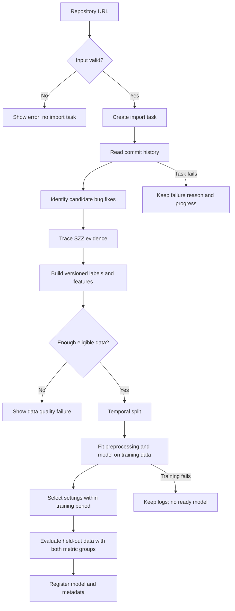
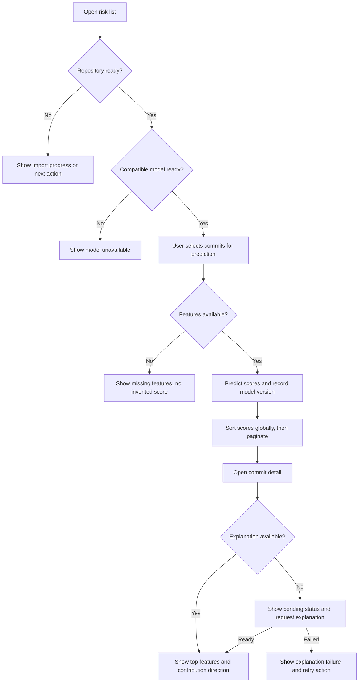

# 核心流程设计 / Core workflow

更新：2026-10-04。状态：T-12 设计草案，团队复核和课程展示用图待完成。依据：产品需求文档 §5.4、§6.1、§7、§8.1；JIT 调研 §3.2。

本稿与[PRD v0.6](产品需求文档.md)及[产品设计](产品设计文档.md)配套。时序、架构和数据库关系图见设计文档；当前工作为Sprint 0，CSV实现单列为技术试做。

Updated: 2026-10-04. This is a design draft for T-12, not an implemented system. Team review and presentation export are pending.

## 模块边界 / Module boundaries

| 模块 / Module | 输入 / Input | 输出 / Output | 用户看到什么 / Visible result |
|---|---|---|---|
| 数据准备 / Data preparation | 仓库地址、采集窗口和标签规则。Repository URL, mining window, and labeling rules. | 提交记录、候选修复、SZZ 证据、标签与 Kamei 特征。Commits, candidate fixes, SZZ evidence, labels, and Kamei features. | 接入进度、成功／失败、数据质量统计。Import progress, success/failure, and data quality. |
| 训练与评估 / Training and evaluation | 已版本化数据集和明确的时间切分。Versioned dataset and explicit temporal split. | 模型文件、登记元数据、两组指标。Model artifact, registry metadata, and both metric groups. | 训练状态、模型版本及可比较的结果。Training state, model version, and comparable results. |
| 预测与展示 / Prediction and display | 提交特征和可用模型。Commit features and an available model. | 分数、风险等级、模型版本和解释。Score, risk level, model version, and explanation. | 风险列表、详情、解释状态。Risk list, detail view, and explanation status. |

## 训练链路 / Training workflow

历史修复证据用于构造训练标签，不是当前提交预测时的输入。未知、无法归因或观察窗口未成熟的标签应单独统计，其具体处理口径仍需 T-5 的正式设计确认。

训练标签必须在训练截止前已可得；不能只检查提交时间先后，再用后来修复构造训练正例。设计§5.1给出历史截止、观察期及训练负例成熟条件，候选参数待Pilot与复核。

Historical fix evidence is used to construct training labels, not as input when predicting a current commit. Unknown, unattributable, and immature labels need separate accounting; formal handling remains part of T-5.

| 节点 / Node | 对应 Story / Story mapping |
|---|---|
| A-C | US-1.1.1：仓库接入 / Repository import |
| D | US-1.2.1：提交解析 / Commit parsing |
| E-F | US-1.3.1、US-1.3.2：修复识别与 SZZ / Candidate fixes and SZZ |
| G | US-1.4.1、US-2.1.1：持久化与特征 / Persistence and features |
| H-I | US-2.2.1、T-5、T-6：数据资格与时间切分 / Eligibility and temporal split |
| J-K | US-3.1.1；Sprint 2 加入 US-3.2.1 / Training, with deep models added in Sprint 2 |
| L | US-3.3.1、US-3.3.2：两类评价 / Both metric groups |
| M | US-3.3.4：模型登记 / Model registration |

切分比例、最小样本量和训练预算沿用 T-4、T-6、T-7 的待确认事项。若保留外层 70%／30%，调参验证应放在前 70% 的时间范围内；最终测试期不参与拟合和调参。边界时刻与标签可用时间需在数据设计中明确。

Split ratios, sample-size requirements, and training budgets remain open decisions in T-4, T-6, and T-7. If the proposed outer 70/30 split is retained, tuning validation belongs within the earlier 70%. Specify boundary timestamps and label-availability times in the data design.

## 用户预测链路 / Prediction workflow

| 节点 / Node | 对应 Story / Story mapping |
|---|---|
| P、V | US-5.1.1：风险列表 / Risk list |
| Q | US-1.1.2：仓库状态 / Repository state |
| R | US-3.3.4：可用模型 / Registered compatible model |
| S-U | US-4.1.1：单条预测；批量候选暂缓 / Single prediction; batch API deferred |
| W | US-5.1.3：提交详情 / Commit detail |
| Y-Z、X4-X5 | US-4.2.1、NFR-2：解释及其状态 / Explanation and its state |

PRD v0.6 的 US-4.2.1 与第七节已统一为同一草案：先返回显式解释状态，完成后展示至少3项真实贡献、方向、方法与单位；失败或超时不满足解释验收。候选时限与正式验收仍需团队确认。

PRD v0.6 now uses one draft contract for US-4.2.1 and section 7: return an explicit status first, then at least three genuine contributions with direction, method, and units when ready. Failure does not satisfy acceptance. Timing values and final criteria remain subject to review.

## 演示边界 / Demonstration boundaries

- **Sprint 1**：至少一个真实基线模型打通仓库接入到风险展示的完整链路；只完成页面或用假分数演示，不算预测链路完成。A real baseline must support the complete import-to-risk flow; fixture-only UI is not a completed predictor.
- **Sprint 2**：补足模型数量、完整比较、数据质量与历史时间趋势；批量接口暂缓。Complete the model count, comparisons, data quality, and historical trends; batch API deferred.
- **历史重放**：分数必须说明模型训练窗口；在训练集上打分只能作为拟合检查，不能算最终测试或真实未来预测。Record the training window; scores on training examples are fit checks, not held-out or future-prediction evidence.
- **当前技术试做**：已有CSV软件链路，见[运行说明](../技术试做/本地基线实现与运行.md)；合成数据仅用于软件检查，不表示需求确认或Sprint 1验收。The CSV application is a technical spike, not an approved requirement baseline or an accepted increment.

## 本轮发现的待确认项 / Open decisions found in this draft

| 项 / Item | 要确认什么 / Decision needed | 关联 / Link |
|---|---|---|
| 解释状态 | 文字已统一为草案，完成时限及方法待实际核对。Draft wording aligned; timing and methods need review. | US-4.2.1、NFR-1、NFR-2 |
| 风险等级 | 阈值与来源，不能把示例阈值当定稿。Define threshold values and their source; demo values are not final. | US-4.1.3、US-5.1.1 |
| 数据资格 | unknown、无法归因、未成熟标签的排除与统计。Define accounting and eligibility for unknown, unattributable, and immature labels. | T-5、T-6 |
| 评价口径 | effort 的代理量、零成本样本、排序及 20% 边界。Define effort proxy, zero-cost cases, ranking, and the 20% boundary. | T-3 |
| 训练切分 | 外层切分、内层验证、标签截止时间和固定预算。Define outer split, internal validation, label cutoff, and budget. | T-4、T-7 |

## AI 辅助记录 / AI assistance record

- 工具 / Tool：Codex（GPT-6），2026-10-04。
- 原始需求 / User request：“看下有什么你可以做的 不要git”；补充四人均为初学者、新成员用英语交流，并要求继续推进。
- 绘图提示词记录 / Recorded diagram prompt：“依据现有产品需求文档 5.4、6.1、7、8.1，生成中英核心流程设计。分开历史数据准备、训练评价与用户预测，覆盖无仓库、无模型、缺少特征、训练失败及解释异步状态，标注 Story ID，注明草案与待确认项，不宣称实现完成。”
- 人工复核 / Human review：待全组复核。Pending team review.
- 使用方式 / Use：本文件保存 Mermaid 图源；复核后可导出或转绘到飞书画板并记录链接。本轮没有编辑飞书。This file stores Mermaid source; export or redraw it after review and record the board link. No Feishu editing was performed in this round.
